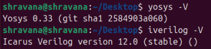

# VSD RISC-V SoC Tapeout Program 
[](https://www.vlsisystemdesign.com/)
[](www.linux.org)
[](https://github.com/)
[](https://riscv.org/)


## 🔰 Introduction  
This repository documents my **learning journey and weekly submissions** for the **VSD RISC-V SoC Tapeout Program**.  

The program is designed to provide hands-on exposure to:  
- 🛠️ Setting up open-source EDA tools  
- ⚡ Understanding RISC-V SoC design flow  
- 🐧 Working with Linux & Git  
- 🚀 RTL design, synthesis, verification, and tapeout  

💡 The aim is to **learn → implement → verify → document → share**.  

---

## 📝 Tasks Overview  

| Week | Focus Area | Status |
|------|------------|--------|
| **0** | [Tool installation, environment setup](#week-0--tool-installation--verification) |  Completed |
| **1** | [Verilog RTL Design & Synthesis](https://github.com/ShravanaHS/week1-riscV-soc-tapeout-vsd/tree/main) | Completed |
| **2** | [BabySoC Fundamentals & Functional Modelling](https://github.com/ShravanaHS/week2-riscV-soc-tapeout-vsd) | Ongoing |
| **3** | Physical design & layout | - |


<details>
  <summary>
     Week 0 – Tool Installation & Verification  
  </summary>

# Week 0 – Tool Installation & Verification 

## Virtual Machine & Tool Installation Guide

### System Requirements
- **RAM:** 6 GB  
- **Storage:** 50 GB HDD  
- **OS:** Ubuntu 20.04 or higher  
- **CPU:** 4 vCPU

### Virtual Machine Setup
- Download and install [Oracle VirtualBox](https://www.virtualbox.org/wiki/Downloads)
- Create a new VM with the above specs.
- Install Ubuntu 20.04 LTS (or newer) inside VirtualBox.

---

### 🔹 Step 1: Update & Install Essential Packages  
```bash
sudo apt update
sudo apt upgrade -y
sudo apt install git make gcc g++ vim build-essential -y
```

---

### 🔹 Step 2: Install Required Tools  

#### ✅ Yosys  
```bash
sudo apt-get update

# Install required dependencies
sudo apt-get install -y \
  build-essential clang bison flex \
  libreadline-dev gawk tcl-dev libffi-dev git \
  graphviz xdot pkg-config python3 libboost-system-dev \
  libboost-python-dev libboost-filesystem-dev zlib1g-dev

# Clone the Yosys repository
git clone https://github.com/YosysHQ/yosys.git

# Enter the yosys directory
cd yosys

# Build Yosys
make

# Install Yosys system-wide
sudo make install

```
📸 *Yosys:*  
  

---

#### ✅ Icarus Verilog (Iverilog)  
```bash
sudo apt-get update
sudo apt-get install iverilog
```
📸 *Icarus Verilog:*  
  

---

#### ✅ GTKWave  
```bash
sudo apt-get update
sudo apt install gtkwave
```
📸 *GTKWave:*  


---


### ✅ Learnings from Week 0  
- Set up Ubuntu VM inside VirtualBox  
- Installed open-source tools (Yosys, Iverilog, GTKWave)  
- Learned Linux command-line basics  

---
</details>

<details>
  <summary>
     Week 1 – Verilog RTL Design and Synthesis
  </summary>
 
  [Verilog RTL Design & Synthesis](https://github.com/ShravanaHS/week1-riscV-soc-tapeout-vsd/tree/main)
</details> 

## Acknowledgments  
  I sincerely thank:  
- [Kunal ghosh](https://www.linkedin.com/in/kunal-ghosh-vlsisystemdesign-com-28084836/) sir and **[VSD (VLSI System Design)](https://vsdiat.vlsisystemdesign.com/)** team for this initiative  
- Mentors & community for guidance  
- Open-source developers for tools like Yosys, Iverilog, GTKWave  

---

##  References  
- [VSD Official GitHub](https://github.com/vlsisystemdesign)  
- [RISC-V International](https://riscv.org)  
- [Linux Command Handbook](https://linuxcommand.org/)  

---

*This repository will be updated weekly with tasks, commands, outputs, and screenshots as I progress through the program.*  
