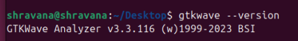

# VSD RISC-V SoC Tapeout Program 
[](https://www.vlsisystemdesign.com/)
[](www.linux.org)
[](https://github.com/)
[](https://riscv.org/)


## 🔰 Introduction  
This repository documents my **learning journey and weekly submissions** for the **VSD RISC-V SoC Tapeout Program**.  

The program is designed to provide hands-on exposure to:  
- 🛠️ Setting up open-source EDA tools  
- ⚡ Understanding RISC-V SoC design flow  
- 🐧 Working with Linux & Git  
- 🚀 RTL design, synthesis, verification, and tapeout  

💡 The aim is to **learn → implement → verify → document → share**.  

---

## 📝 Tasks Overview  

| Week | Focus Area | Status |
|------|------------|--------|
| **0** | Tool installation, environment setup | ✅ Completed |
| **1** | RISC-V toolchain exploration, basic simulation | - |
| **2** | RTL design & synthesis | - |
| **3** | Physical design & layout | - |


<details>
  <summary>
     Week 0 – Tool Installation & Verification  
  </summary>

# Week 0 – Tool Installation & Verification 

### 🔹 Step 1: Update & Install Essential Packages  
```bash
sudo apt update
sudo apt upgrade -y
sudo apt install git make gcc g++ vim build-essential -y
```

---

### 🔹 Step 2: Install Required Tools  

#### ✅ Yosys  
```bash
sudo apt-get update
sudo apt-get install yosys
```
📸 *Yosys:*  
  

---

#### ✅ Icarus Verilog (Iverilog)  
```bash
sudo apt-get update
sudo apt-get install iverilog
```
📸 *Icarus Verilog:*  
  

---

#### ✅ GTKWave  
```bash
sudo apt-get update
sudo apt install gtkwave
```
📸 *GTKWave:*  


---


### ✅ Learnings from Week 0  
- Set up Ubuntu VM inside VirtualBox  
- Installed open-source tools (Yosys, Iverilog, GTKWave)  
- Learned Linux command-line basics  

---
</details>

<details>
  <summary>
     Week 1 – Coming Soon 
  </summary>
## Week 1 – Coming Soon  

🔜 Planned tasks:  
- Setup RISC-V toolchain  
- Run sample RISC-V programs  
- Capture waveforms & document simulation results  

---
</details> 

## Acknowledgments  
I sincerely thank:  
- Kunal gosh sir and **VSD (VLSI System Design)** team for this initiative  
- Mentors & community for guidance  
- Open-source developers for tools like Yosys, Iverilog, GTKWave  

---

##  References  
- [VSD Official GitHub](https://github.com/vlsisystemdesign)  
- [RISC-V International](https://riscv.org)  
- [Linux Command Handbook](https://linuxcommand.org/)  

---

*This repository will be updated weekly with tasks, commands, outputs, and screenshots as I progress through the program.*  
